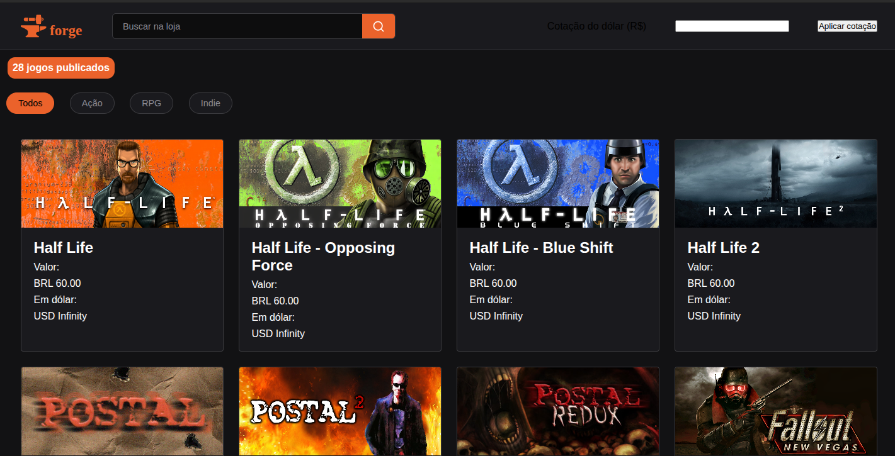

# forge




## Integrantes

| Nome | Usuário GitHub | Responsabilidade |
|------|----------------|------------------|
| Luiz Gustavo  | @oluizf       | Estrutura HTML |
| Gustavo  | @gustavoevan0729      | Estilos CSS |
| Jorge Luis | @im-daxter | Estrutura HTML & Javascript |

## Tecnologias

 HTML
 CSS
JavaScript

## Como executar
 
 Clone o repositório: 
 ```
git clone https://github.com/oluizf/forge.git
 ```

 Abra a pasta no VS Code
 Clique com o botão direito em `index.html` e escolha **Go Live**
 
## Estrutura de pastas
```
forge/
├── css/
├── js/
├── logo/
├──images/
└── index.html/
├── README.md/
```
 
## Andamento
 
 [x] Estrutura das páginas
 [x] Estilos principais
 [x] Conversão de valores com JavaScript
 
 O quadro de tarefas completo está na aba **Projects** do repositório.
